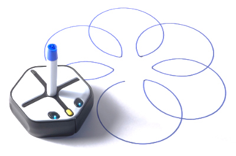
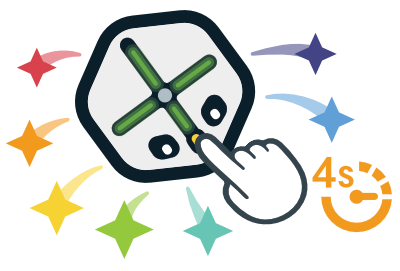
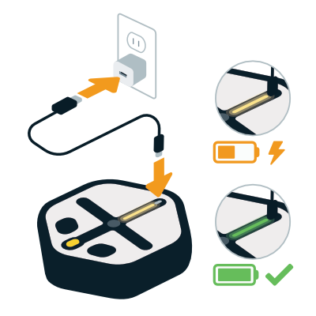
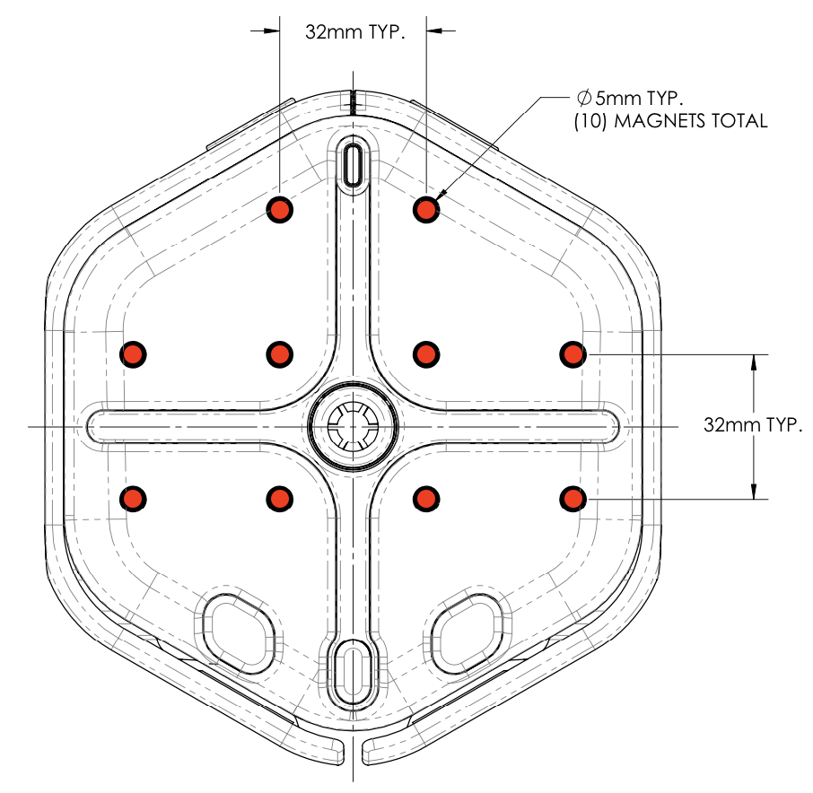

# Root® Robot Documentation

The [iRobot® Root® Coding Robot](https://edu.irobot.com/root) is a toy robot that teaches the basics of coding to kids of all ages and skill levels.
The robots can programed using the companion iRobot Coding app on [iOS](https://apps.apple.com/us/app/irobot-coding/id1524652548), [Android](https://play.google.com/store/apps/details?id=com.rootrobotics.rootcoding), or [Web](https://code.irobot.com/).
Advanced users can also use the [iRobot Education Python Web Playground](https://python.irobot.com/) or downloadable [iRobot Education Python 3 SDK](https://github.com/iRobotEducation/irobot-edu-python-sdk) for even more control over the robots.

## Instructions For Use

**LOW BATTERY WARNING** - If Root flashes red, then the battery is low and needs to be charged.

**CLICKING NOISE** - Root’s drive wheels have internal clutches to prevent damage to the motors if Root is pushed or gets stuck.

**PEN / MARKER COMPATIBILITY** - Root’s marker holder will work with many standard sizes. The marker or pen should not touch the surface underneath until Root lowers the marker holder.

**WHITEBOARD COMPATIBILITY** (model RT1 only) - Root will operate on vertical whiteboards that are magnetic. Root will not operate on magnetic whiteboard paint.

**ERASER FUNCTION** (model RT1 only) - Root’s eraser will only erase dry erase marker on magnetic whiteboards.

**ERASER PAD CLEANING / REPLACEMENT** (model RT1 only) - Root’s eraser pad is held in place with a hook-and-loop fastener. To service, simply peel off the eraser pad and wash or replace as needed.

## Turning Root On/Off

To turn the Root robot on or off, press and hold the yellow button (otherwise referred to as its “nose”) until the lights turn on/off (around 4 seconds).

If Root is not responding as expected, hold the power button for 10 seconds to force the Root robot to turn off.

> [!TIP]
> Pressing the yellow nose button will stop the motors and tell the iRobot Coding app to stop the running project.

## Charging

To charge your Root robot, plug a powered USB cable into the USB-C port on the top of the robot.
For the quickest charging, we recommend using a USB charger capable of supplying 5W (5V, 1A) or greater.
We also recommend always using the USB cable supplied with the robot.

While the robot is charging, a light on top of the robot will flash yellow.
Once the robot is fully charged, the light will stay green.
Please note that the robot is not able to connect over Bluetooth while it is charging.

The Root robot can also be charged by applying 6.5V-9V across the two charging contacts on the rear of the robot.
However, charging through the contacts will typically be slower than through the USB-C port.

For safety and power efficiency, please observe the following precautions:
- Regularly examine for damage to the cord, connectors, plug, enclosure, or other parts, and stop use in the event of damage.
- Do not charge near a flammable surface or material, or near a conducting surface.
- Do not cover your robot while charging.
- Do not leave robot unattended while charging, and disconnect charging cable when robot is finished charging.
- Charge at temperatures between 0 and 32 degrees C (32-90 degrees F). Never charge while the device is hot.

## Bluetooth connection

Root coding robots are controlled over a Bluetooth® Low Energy connection by a companion device, such as a laptop, tablet, phone, or Raspberry Pi.
Root robots are available to connect over Bluetooth® whenever 
1. the robot is powered on (i.e. the eyes are on) and 
2. it not connected to another device.

Once you connect to the robot, it will play a chime and the lights will briefly flash blue.
To disconnect, trigger a disconnection from the app or turn off the robot by holding down the yellow nose button.

The companion iRobot Coding app provides graphical, hybrid, and text coding experiences for learners of all skill levels, and it is available on [iOS](https://apps.apple.com/us/app/irobot-coding/id1524652548), [Android](https://play.google.com/store/apps/details?id=com.rootrobotics.rootcoding), and [Web](https://code.irobot.com/) (using a Web Bluetooth compatible browser like [Chrome](https://www.google.com/chrome/) or [Edge](https://www.microsoft.com/edge)).
Advanced users can access even more capabilities using the downloadable [iRobot Education Python 3 SDK](https://github.com/iRobotEducation/irobot-edu-python-sdk) or in-browser Python coding experience within the [iRobot Education Python Web Playground](https://python.irobot.com/).
All of these coding interfaces implement the openly documented [Bluetooth® Low Energy protocol](https://github.com/iRobotEducation/root-robot-ble-protocol) used by the Root robots.

## Care and Cleaning
- Do not expose robot to high temperature conditions such as direct sunlight or hot car interiors. For best results use indoors only. Never expose Root to water.
- Root has no serviceable parts though it is important to keep the sensors clean for optimal performance.
- To clean sensors, lightly wipe top and bottom with a lint-free cloth to remove smudges or debris.
- Do not attempt to clean your robot with solvent, denatured alcohol, or flammable liquid. Doing so may damage your robot, make your robot inoperable, or cause a fire.
- Electrostatic discharge may affect the performance of this product and cause malfunction. Please reset the device using the following steps:
(1) unplug any external connections,
(2) hold the power button for 10 seconds to turn off the device,
(3) press the power button to turn the device on again.

## Mechanical

### Top Magnets

Root has ten small magnets underneath the top surface to help with attaching accessories. These 5mm-diameter magnets are in a 32mm x 32mm grid as shown in the image below. Each magnet has the North pole facing up. You can use these to hold accessories in place by gluing magnets to your accessory that line up with the magnets in Root. (*Make sure the magnets are facing the right direction first!*)

## Electrical

Root has the ability to provide power to an accessory from the USB-C port. When the robot detects an Upwards Facing Port, e.g. a USB device, rather than a USB charger or host it will supply 5V with a maximum of 250mA to the VBUS pin of the USB-C port.

[This cable](https://www.amazon.com/AmazonBasics-USB-Type-C-Micro-B-Cable/dp/B01LONQBDG/) has been verified to work with the robot.

[This article](https://www.embedded.com/design/power-optimization/4458380/USB-Type-C-and-power-delivery-101-----Ports-and-connections) contains more information about USB-C cable configurations.

## Frequently Asked Questions

### About the Root® coding robots

<b>What are Root® coding robots?</b>

Root® coding robots, software, and curriculum teach programming and STEM fundamentals in an engaging and flexible way. They incorporate problem solving, art, math and more, with an intuitive app and versatile mobile robot to keep students engaged throughout their learning journey. Bridging the gap between K-12 education, Root® coding robots provide a continuous learning platform that advances alongside students’ abilities. For schools, this means more personalized classroom learning, better student engagement, and less money and time spent on single-purpose software and hardware.

<b>What age(s) are the Root® coding robots designed for?</b>

Root® coding robots are designed for learners who are 6 years of age and up. For children under the age of 6, helping hands are recommended.

<b>Do I need an app to control the Root® coding robots?</b>

Yes. Root® coding robots are controlled by their companion iRobot Coding App.

The iRobot Coding App is compatible with Bluetooth® Low Energy (BLE) devices running most major, up-to-date operating systems, including Windows, macOS, ChromeOS, Linux, iOS, iPadOS, and Android.

The iRobot Coding App can be downloaded from the [Apple App Store](https://apps.apple.com/app/id1524652548), [Google Play Store](https://play.google.com/store/apps/details?id=com.rootrobotics.rootcoding), or used online at [code.irobot.com](https://code.irobot.com/). When connecting to your robot using the online [Web App](https://code.irobot.com/), please also ensure you are using a browser that supports Bluetooth® Low Energy (BLE) technology, such as Chrome or Edge.

<b>Which model of Root® coding robot should I choose?</b>

Suitable for all skill levels, Root® coding robots require minimal setup, are packed with programmable sensors, draw on paper or vertical magnetic whiteboards, and can be expanded to do even more. There are two versions of the Root® robot series:
- The Root® Lite coding robot (SKU: RT00020) makes it easy to bring more robots into your home or learning space for less. Designed to provide a balance of value and utility, the Root® Lite is equipped with the essential features to transform learning to code into a grand adventure. If you’re looking for a way to bring code alive through art, music, and exploration, the Root® Lite is the choice for you. It features a bright white base with a translucent top.
- The Root® Pro coding robot (SKU: RT001) provides the ultimate interactive coding experience. From navigating flat, horizontal surfaces to vertical, magnetic whiteboards, the Root® Pro makes the most of your space while also defying gravity. In addition to all the features seen in the Root® Lite, the Root® Pro comes with a color sensor, an eraser, and a cliff sensor for even more ways to take STEM learning to the next level. It features a jet-black base with a whiteboard top.

<b>What programming languages do the Root® coding robots teach?</b>

Root® coding robots are controlled by their companion learn-to-code Apps. 

The **iRobot Coding** app is available for free across Web, iOS, and Android devices. It teaches key skills by separating learning to code into three (3) progressive Learning Levels. These Learning Levels are designed to scaffold how students learn to code by catering to any coding ability, from pre-readers to advanced users: 
- **Learning Level 1** uses drag-and-drop, graphical blocks to teach the fundamental logic skills of coding. No reading skills are required for this level. 
- **Learning Level 2** builds computational fluency with hybrid blocks that feature a mixture of graphics and coding script. 
- **Learning Level 3** uses full-text code to teach the structure and syntax of professional coding languages, including the powerful and intuitive Python programming language. 

For those interested in taking their learning to the next level, the iRobot Python Apps (BETA) provide a direct pathway to graduate from block-based coding to entirely text-based Python coding environments.

<b>Can I control the Root® coding robots from other programming environments?</b>

The Root® coding robots are designed to be used with the iRobot Coding App. The iRobot Coding App is compatible with devices running most major, up-to-date operating systems, including [Web](https://code.irobot.com/), [iOS](https://apps.apple.com/app/id1524652548), and [Android](https://play.google.com/store/apps/details?id=com.rootrobotics.rootcoding).

In order to connect your Root® coding robots to the iRobot Coding App, your device requires Bluetooth® Low Energy (BLE) and a [Web Bluetooth](https://developer.mozilla.org/en-US/docs/Web/API/Web_Bluetooth_API#browser_compatibility) supported browser like Chrome or Edge. 

For the advanced coders out there, we've published the Root® coding robots’ [Bluetooth® Low Energy (BLE) protocol](https://github.com/RootRobotics/root-robot-ble-protocol), so that experienced makers can start creating their own advanced projects with the robot. This link should provide enough information for you to connect to and use the robot with any hardware that supports BLE using the programming language and Bluetooth® library of your choice.

Please note: This requires advanced coding experience and some understanding of how BLE works. To help you get started, we’ve included a basic sample script that runs on a Raspberry Pi® 3 to drive your Root® coding robots using arrow keys.

<b>What skills will my students learn with the Root® coding robots?</b>

Our Root® coding robots are designed and piloted with educators to reduce common barriers to STEM education. Recognizing that one of the greatest challenges is finding tools that appeal to a range of ages, skill levels, and interests, Root® coding robots and accessories cater to visual, auditory, and kinesthetic learners by delivering immersive, scalable, cross-curricular learning experiences. We encourage you to visit our [Learning Library](https://edu.irobot.com/learning-library) for examples of multiple ways to engage with these robots.

### Getting Started with the Root® coding robots

<b>How do I power my Root® coding robot on/off?</b>

**To power your Root® coding robot on**, press and hold the robot’s yellow button (otherwise referred to as its “nose”) for three seconds until its LED lights turn on. 

**To power your Root® coding robot off**, press and hold the robot’s yellow button (otherwise referred to as its “nose”) for three seconds until its LED lights turn off.

For additional help and information on getting started, we invite you to explore the [Learning Library](https://edu.irobot.com/learning-library).

<b>How do I connect to and control my Root® coding robot?</b>

To connect to and control your Root® coding robot,
- Place your Root® coding robot on a flat surface, such as the fold-out whiteboard that’s included in the box.
- Power your Root® coding robot on by pressing and holding the robot’s yellow button (otherwise referred to as its “nose”) for three seconds until its LED lights turn on.
- Power on your Bluetooth® Low Energy (BLE) device and ensure its Bluetooth® settings are active.
- Open the iRobot Coding App on your BLE device ([Web](https://code.irobot.com/), [iOS](https://apps.apple.com/us/app/irobot-coding/id1524652548), or [Android](https://play.google.com/store/apps/details?id=com.rootrobotics.rootcoding)).
- Click on the plus (+) icon under the “My Projects” header in the Content Manager.
- Open the Bluetooth® connection window by clicking on the Root® coding robot icon to the right of the project title in the Project Editor.
- Select the Root® coding robot that you would like to connect with.
- Begin coding in the Project Editor!

For additional help and information on getting started, we invite you to explore the [Learning Library](https://edu.irobot.com/learning-library).

<b>Are there any resources to get started with the Root® coding robot?</b>

Yes! Please visit our [Learning Library](https://edu.irobot.com/learning-library) for an abundance of resources to help you get started including starter tutorials, projects, and videos.
Our [Learning Library](https://edu.irobot.com/learning-library) provides an expansive collection of lessons that help teachers and integrate coding and robotics into the curriculum by exploring a wide range of topics and genres.
- Beginner content includes a curated assortment of free activities, videos, sample coding projects, and DIY coding competition kits.
- Access to premium curriculum modeled after educational standards (such as CSTA) and self-guided or custom professional development trainings are also available for purchase.

<b>Is there curriculum available to help me teach with the Root® coding robot?</b>

Yes. Our made-for-classrooms curriculum is designed to fit seamlessly into your school year with over 75 scaffolded, hands-on, project-based activities. This curriculum is specifically mapped to several international standards sets, such as the US Common Core Standards, CSTA, UK Key Stages, and more.

Each lesson includes 40-60+ minutes of outlined instruction with multiple engagement points, such as:
- Class discussion
- Team-based project
- Reflection activity
- Going further extensions

By utilizing the multiple programming levels in the iRobot Coding App, each lesson provides multiple opportunities for every student to feel appropriately engaged and academically challenged, regardless of their coding background. This integrated scaffolding approach with the App and robot promotes a cohesive and inclusive classroom experience. Additionally, embedded math, ELA, science, and arts connections create cohesive, school-wide learning opportunities.

The curriculum is available in a digital format that allows you to conveniently print a copy for each member of your teaching team and review your lesson plans inside or outside of the classroom. With prepared lessons already designed to meet their required learning objectives, teachers can spend more time teaching and less time planning.

### Technical questions

<b>How do I update the firmware on my Root® coding robot?</b>

Normally, the iRobot Coding apps should detect the version of the firmware running on the robot and prompt you to update when needed.
If you do not receive a prompt, you may manually update the robot by completing the following steps:
1. Power off the robot by pressing and holding the robot’s yellow button (otherwise referred to as its “nose”) for three seconds until its LED lights turn off.
2. Wait 10 seconds to make sure that the robot is fully powered off.
3. Hold down both the left and right bumpers.
4. While still holding down both bumpers, hold the robot’s yellow button (its “nose”) down for 10 seconds, or until the robot’s LED lights start flashing blue. (The robot flashes blue to indicate that it is in "update” mode).
5. Navigate to the web updater page using a Web Bluetooth compatible browser, such as Chrome or Edge.
6. Press the “Pair” button and select the "ROOT BOOT" robot from the connection list. You should only see devices that are in "update” mode as connection options on this page.
7. Press the “Update” button and wait for the update to complete.

<b>How fast can Root® coding robots drive?</b>

Root® coding robots can drive up to 10 cm/s.

<b>How does the Root® Pro coding robot stick to a magnetic vertical whiteboard?</b>

The Root® Pro coding robot has magnets embedded inside its chassis to help it climb whiteboards and connect to accessories.

<b>Why does the color sensor turn off when I pick the Root® Pro coding robot up?</b>

The Root® Pro coding robot only detects color when it's driving on a flat surface. You may cover the cliff sensor on the robot if you would like to see the color sensor run while picked up.

<b>How do I calibrate the Root® Pro coding robot’s color sensor?</b>

The Root® Pro coding robot will automatically calibrate to the reflectiveness of the surface underneath the robot. We recommend that you leave the robot on a white surface for a few seconds before starting a color sensing program.

<b>Why do the wheels stop when I pick the Root® Pro coding robot up?</b>

The Root® Pro coding robot is designed to only drive on flat surfaces. Its integrated cliff sensor allows the robot to detect when it is lifted.

<b>What type of charger do Root® coding robots require?</b>

For full charging speeds, Root® coding robots require a minimum 5W (5V, 1A) USB charger. We recommend always using the charging cable provided with the robot.

<b>How long do the Root® coding robots’ batteries last?</b>

The Root® coding robots’ batteries will typically last for 2 hours of continuous, heavy-use, and 1 week with intermittent use.

<b>How long do Root® coding robots take to charge?</b>

The charging speed is dependent on the amount of current your USB adapter can provide. 
Adapters with 5W or more should charge at full speed and be and to charge completely (from empty to full) in under 3 hours.

<b>How do I know that the Root® coding robots are fully charged?</b>

When Root® coding robots are fully charged, the LED lights on the top of the robot will glow green.
You should unplug the charger when the battery is full.

<b>Why isn’t my Root® coding robot charging?</b>

The charging cable provided should always be used to charge your robot. If your Root® coding robot does not indicate that it is charging – even when using the provided charging cable and a minimum 5W USB adapter – the battery may be at too low of a voltage.

If this is the case, please follow the steps below: 
- Plug your robot in and wait 1 hour. (The robot should slowly charge even if it does not flash the LED lights.)
- After 1 hour, unplug the robot, then plug it back in again.
- If the LED light still does not light up, leave the robot plugged in and repeat these steps after an additional hour.

If your robot is still not charging after following the above instructions, please contact us. 

<b>Why won’t my Root® Pro coding robot stick to my whiteboard?</b>

Please note that the Root® Pro coding robot is the only model designed to attach to and navigate magnetic whiteboard surfaces. On some whiteboards with weak magnetic backing, the Root® Pro coding robot might slip. Other whiteboards may not have any magnetic backing at all. Please note that you can still use a non-magnetic whiteboard with either model of the Root® coding robot model as long as the robot is placed on a flat surface, such as a table or the floor.

<b>Why won’t my Root® coding robot draw on a flat surface?</b>

If your Root® coding robots won't draw on a flat surface, such as the fold-out whiteboard that it comes with, please check the marker holder. Although the robot's marker holder can hold several different brands of dry-erase markers and pens, many of these tools come in different shapes and sizes. This means that there may be an assortment of pencils, crayons and some pens that cannot be gripped by the robot’s marker holder. The marker should be just above the drawing surface when the marker holder is in the up position. When the marker holder is programmed to go down, the marker should go down below the wheel height. If the Root® Pro coding robot detects a cliff, the robot will automatically lift the marker to prevent it from drawing when it is placed back down.

<b>Why won’t my Root® Pro coding robot erase?</b>

The Root® Pro coding robot's eraser works best on magnetic whiteboard surfaces. The eraser has embedded magnets to hold it firmly against the smooth surface of magnetic whiteboard so that it can erase. On the included fold-up whiteboard, the robot is not always able to press down hard enough to erase and the eraser pad can get caught on the folds, pushing the robot off course.

<b>Why does my Root® coding robot slip when it drives?</b>

If your Root® coding robot is not driving well, please check if the wheels are dirty. If they are, the robot may slip more than usual. Please try cleaning the wheels with some rubbing alcohol and a paper towel.

<b>Why is my Root® coding robot turning to the left or right when it should be driving straight?</b>

If your Root® Pro coding robot is driving vertically on a whiteboard, this may be normal behavior while the robot compensates for gravity. If either your Root® Pro or Root® Lite robot has problems driving on a flat surface, such as a table or the floor, then there may be something wrong with your robot. Please contact us for assistance.

<b>Why is my Root® coding robot frozen or unresponsive?</b>

If your Root® coding robot is frozen or unresponsive, try to hold the yellow button (its nose) for 10 seconds until the robot turns off. Then, turn the robot back on. If the robot flashes red, the robot needs charging. If the robot does not move when you code a program and press play, ensure that your device and iRobot Coding app are properly connected to that robot. You will need to reconnect to the robot after it is reset.

If your robot is still misbehaving after being reset, please contact us for assistance.

<b>Why is my Root® coding robot stopping in the middle of a program?</b>

If your Root® coding robot keeps stopping in the middle of a program, try charging your robot and your device. A low battery can cause connectivity problems or make the robot unable to maintain the proper wheel speeds. The robot may also stop if it detects that the wheels are stuck (e.g. if it is being pushed or is driving into an obstacle). If both devices have enough charge, ensure that you are running the latest version of the iRobot Coding app and that the firmware on your Root® coding robot is up to date. 

<b>Why is the LED light on the back of my Root® coding robot flashing red on its own?</b>

The rear LED on the Root® coding robot will flash red when the battery is getting low. Please plug it in to charge using the provided charging cable.

<b>Why is my Root® Pro coding robot moving slowly and making additional movements on the whiteboard?</b>

If your Root® Pro coding robot is moving slowly and making additional movements on a vertical magnetic whiteboard, it is likely because the robot is using its sensors and corrective algorithms to compensate for gravity and draw the most accurate shapes possible. 

<b>My Root® robot keeps stopping, beeping, and blinking red. Help?</b>

The robot will flash red and beep when (1) the battery level gets too low or (2) it detects that a wheel is stuck. If your robot still flashes red, beeps twice, and stops moving when it is fully charged, then the robot is likely triggering a stuck or “stalled” motor error. 
 
Some reasons this error can be triggered include:
1. **Something is blocking the wheel or robot.** This is the most common reason for a motor stall. Please make sure nothing is stuck around the wheels and that they can rotate normally.
2. **The motor connector is unplugged from the printed circuit board in the robot.** You can often tell this is the problem by manually rotating both wheels with your fingers while the robot is ON. Because the motor brakes are applied when the robot is ON, if the stalled wheel is easier to spin than the non-stalled wheel, it may just be unplugged.
3. **If there is an issue with the motor itself.** If the robot is OFF for 10 seconds — and therefore the motor brakes are OFF — and the stuck wheel is harder to rotate than the other wheel, then there may be an issue with the motor or gearbox.
4. **If the wheel encoder has broken (e.g. because of a fall from a significant height).** This may be the issue if both motors feel the same when manually rotating them but one wheel moves faster than the other (making more noise) before the robot beeps and flashes red.
 
If you believe that you are experiencing this issue, please contact us with the serial number from the bottom of the robot (or a photo of the label on the bottom) along with a copy of your purchase confirmation to verify the robot's warranty status. If you did not purchase directly from us, please reach out to the respective provider.

<b>Why are the LED lights on my Root® coding robot flashing blue?</b>

If your Root® coding robot is flashing blue with the eyes off, then the robot is in “update” mode. This can happen if a firmware update is started but fails to complete successfully.

To troubleshoot this occurrence, you can manually restart the firmware update by following the instructions below:
1. Navigate to the [firmware updater page](https://code.irobot.com/update/index.html) using a Web Bluetooth® Low Energy (BLE) compatible browser, such as Chrome or Edge.
2. Press the “Pair” button and select the "ROOT BOOT" robot from the connection list. You should only see devices that are in "update” mode as connection options on this page.
3. Press the “Update” button and wait for the update to complete.

Alternatively, you may use the iOS or Android apps. When you connect to the robot from within the app, it should detect that the robot is in "update mode" and complete the firmware update process. Please contact us with a summary of your experience if you are not able to update your robot.

<b>How can I reset my Root® coding robot?</b>

Regular Reset:
To regularly turn off your Root® coding robot and/or force a disconnection of the Bluetooth® Low Energy connection:
- Power your Root® coding robot off by pressing and holding the robot’s yellow button (otherwise referred to as its “nose”) for three seconds until its LED lights turn off.
- Wait for about 10 seconds to allow the robot to fully shut down.
- Power your Root® coding robot back on by pressing and holding the robot’s yellow button (otherwise referred to as its “nose”) for three seconds until its LED lights turn on. 

Forced Reset:
If your Root® coding robot is not responding as expected, you can perform a forced reset:
- Force reset your Root® coding robot by pressing and holding the robot’s yellow button (otherwise referred to as its “nose”) for ten seconds. This action forces the robot to turn off completely.
- Power your Root® coding robot back on by pressing and holding the robot’s yellow button (otherwise referred to as its “nose”) for three seconds until its LED lights turn on. 

Factory Reset:
A traditional factory reset erases the information and settings on devices. Given that Root® coding robots do not retain any user data from previous usage, users do not need to conduct a factory reset. If you have changed the robot’s name, you may choose to rename it back to the original name of “ROOT” to simulate a factory reset.

### Features and Accessories

<b>Can I decorate my Root® coding robots?</b>

Yes. The top of the Root® Pro coding robot features a whiteboard surface that users may decorate using dry-erase markers, vinyl clings, or printable outfits from the [Learning Library](https://edu.irobot.com/learning-library). While the top of the Root Lite coding robot does not feature a whiteboard surface, users may still decorate this model using vinyl clings or printable outfits from the [Learning Library](https://edu.irobot.com/learning-library). 

<b>Do Root® coding robots require a special type of marker or pen?</b>

Root® coding robots support a wide range of markers and pens, but not every brand or design will work.
To ensure proper operation, insert the marker when the holder is raised and leave a small gap between the surface and the tip of the marker.
For markers that are too narrow, you may try wrap some tape around the neck of the marker to widen the diameter until it can be held in place.

<b>Why won’t my dry-erase marker erase from my whiteboard?</b>

Please ensure that any whiteboard surface is a proper dry-erase surface before using it. You should be able to wipe away most marks with a damp cloth. If the mark still won’t come off with that, try drawing over the stubborn stain with a fresh dry erase marker. Once drawn over, you should be able to wipe it clean with a cloth. Please note that the marker you use for cleaning will pick up some of the color you are drawing over, so use a darker marker to clean if possible.

## Trademarks

iRobot and Root are registered trademarks of iRobot Corporation.

The Bluetooth word mark and logos are registered trademarks owned by Bluetooth SIG, Inc. and any use of such marks by iRobot is under license.

Apple, App Store, iPadOS, and macOS are registered trademarks of Apple Inc.

Android, Google Play, Chrome, Chromebook, and ChromeOS are trademarks of Google LLC.

Microsoft, Edge, and Windows are registered trademarks of Microsoft Corporation in the United States and/or other countries.

Python is governed by the Python Software Foundation. All other trademarks mentioned are the property of their respective owners.

USB-C and USB Type-C are registered trademarks of USB Implementers Forum.

Raspberry Pi is a trademark of Raspberry Pi Ltd.

## License

Root® Robot Documenation is licensed under a Creative Commons Attribution-NonCommercial 4.0 International License.

You should have received a [copy of the license](LICENSE.txt) along with this work. If not, see <https://creativecommons.org/licenses/by-nc/4.0/>

